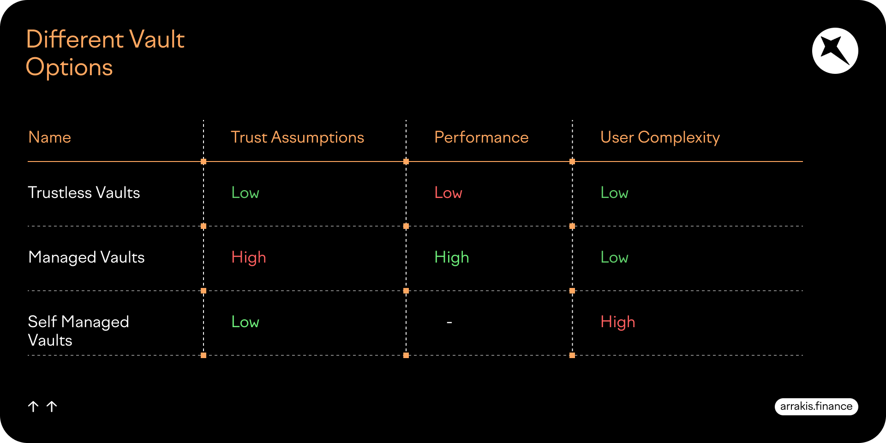
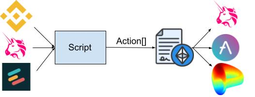

## Overview

Script is an experimental framework for writing performant trustless trading strategies.

## Problem

Script solves the non-custodial vault trilemma outlined in the [Arrakis v2 docs](https://resources.arrakis.fi/arrakis-v2-protocol/vaults): 

- **Trustless Vaults** implement strategies in smart contracts, so are trustless and low-friction **but** the strategies are public and limited by gas costs.
- **Managed Vaults** are operated by an off-chain manager so are private, easy to use and not limited by gas **but** require trusting the manager.
- **Self Managed Vaults** require the user to operate themselves so are private, not limited by gas, don't require trusting anyone **but** are complex to operate.

## Architecture

In Script, trading strategies (or scripts) are themselves zero-knowledge circuits. As a result:
- Scripts are private, preventing exploitation and protecting IP.
- Scripts are verified succintly on-chain keeping gas costs low (constant) even for sophisticated strategies.

## Getting Started

1. Install circom and snarkjs [here](https://docs.circom.io/getting-started/installation/)
2. Run `npm install`
3. Run `npm generate` to run [generate.sh](./circuits/generate.sh)
4. Run `npm run strategy` to run [strategy.js](./utils/strategy.js)
5. (Optionally) Run `npm run test` to test the [smart contracts](./contracts/)

## Future work

- Write some more sophisticated strategies involving more signals (e.g. all liquidity positions, volatility)
- Move to a higher level DSL for writing the circuits, e.g. Noir